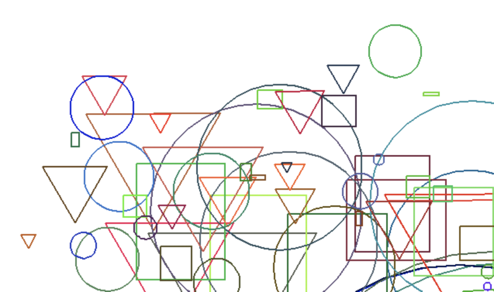

# canvas-drawer

Implements a simple drawing api

TODO: Add a representative image for your project here

## How to build

*Windows*

Open git bash to the directory containing this repository.

```
canvas-drawer $ mkdir build
canvas-drawer $ cd build
canvas-drawer/build $ cmake -G "Visual Studio 16 2019" ..
canvas-drawer/build $ start Draw-2D.sln
```

Your solution file should contain two projects: `pixmap_art` and `pixmap_test`.
To run from the git bash command shell, 

```
canvas-drawer/build $ ../bin/Debug/draw_test
canvas-drawer/build $ ../bin/Debug/draw_art
```

*macOS*

Open terminal to the directory containing this repository.

```
canvas-drawer $ mkdir build
canvas-drawer $ cd build
canvas-drawer/build $ cmake ..
canvas-drawer/build $ make
```

To run each program from build, you would type

```
canvas-drawer/build $ ../bin/draw_test
canvas-drawer/build $ ../bin/draw_art
```

## Supported primitives

TODO: Document the custom primitives supported by your canvas class
Primitives:
* Points
* Lines
* Triangles
* Rectangles
* Circles

Canvas Features:
* Drawing a line (with different slopes)
* Drawing a triangle
* Coloring the background
* Creating interpolated lines and interpolated triangles
* Creating composite shapes using triangles with overlaps

Additional Canvas Features:
* Gradient background
* Drawing a circle
* Drawing a rectangle
* Letting the user set line widths
* Adding a point primitive
* Supporting both filled and outlined shapes

## Results

TODO: Show artworks using your class
Image:
1. horizontal line - horizontal-line.png:                                


2. vertical line - vertical-line.png:                                


3. diagonal line - diagonal-line-1.png:                                


4. Height less than width line - h-lessthan-w-line-1.png                          


5. Width less than height line - w-lessthan-h-line-1.png:                         


6. Opposite diagonal line - diagonal-line-2.png:                                


7. Height less than width line - h-lessthan-w-line-2.png:                         


8. Width less than height line - w-lessthan-h-line-2.png:                        


9. Interpolated color line - line-color-interpolation.png:                        


10. Triangle with interpolation - triangle.png:                                


11. Quad - quad.png:                                


12. Gradient background - gradient-background.png:                                


13. Different line widths, Black and White - diff-widths-bw.png:                  


14. Different line widths, Color - diff-widths-color.png:                         


15. Triangles with interpolation randomized in size, color, and location - triangle-randomized.png:


16. Outlined shapes, randomized in size, color, and location - outline-shapes-colorful.png: 


17. Filled-in shapes, randomized in size, color, and location - fill-shapes-colorful.png:  
